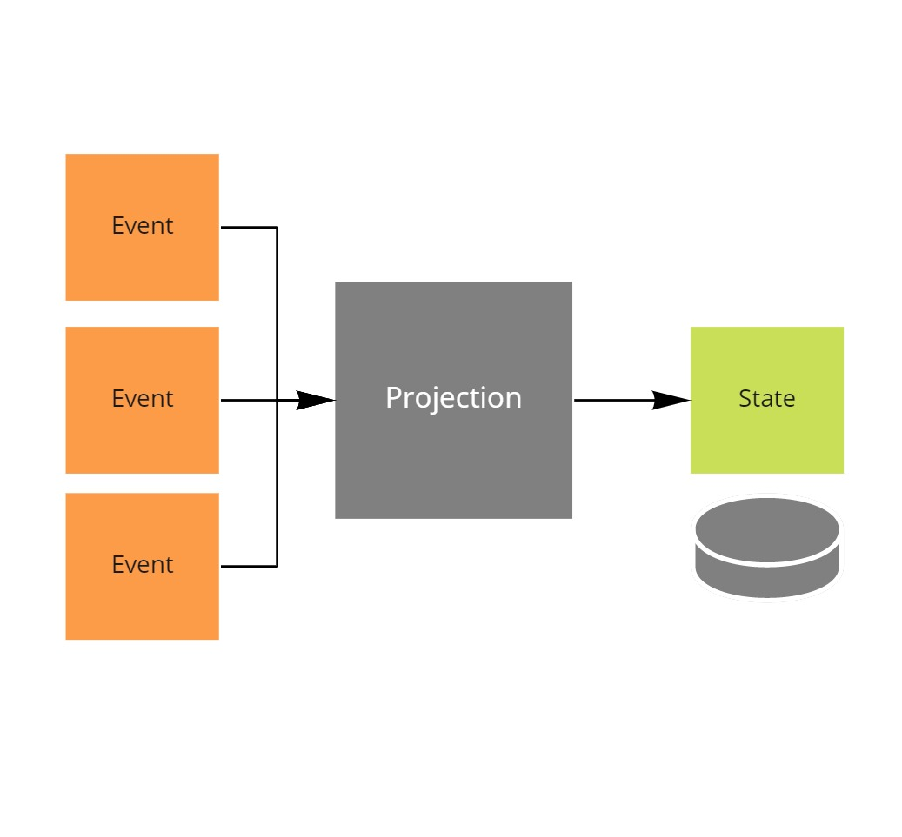

# Designing a Projection

This project is part of the [MessageHandler processing patterns](https://www.messagehandler.net/patterns/) library.

MessageHandler is distributed under a commercial license, for more information on the terms and conditions refer to [our license page](https://www.messagehandler.net/license/).

## What you need to get started

- The [.NET 6 SDK](https://dotnet.microsoft.com/en-us/download) should be installed
- The sample was created using [Visual Studio 2022 community edition](https://visualstudio.microsoft.com/vs/)
- A general purpose [azure storage account](https://docs.microsoft.com/en-us/azure/storage/common/storage-account-create?tabs=azure-portal) is used to store events.
- The **MessageHandler.EventSourcing.AzureTableStorage** package is available from [nuget.org](https://www.nuget.org/packages/MessageHandler.EventSourcing.AzureTableStorage/)

## What is a Projection

TODO

## When to use it

Use this pattern to turn an event stream into state that can be interpretted by users.

## Usage of the Projection pattern

TODO

## Implementing the Projection

TODO

## Loading the projection from and to Azure Table Storage

TODO

## Designed with testing in mind

MessageHandler is intented to be test friendly.

TODO